## Introduction

::: {.notes}
In this second lecture we will introduce a tool called [Data Version Control](https://dvc.org), often shortened to DVC, which can be used to automate some of the tasks involved in accessing data and managing the steps in data pipelines that we encountered in the previous lecture.

Importantly, as suggested by the name, DVC also provides a systematic way of keeping track of different versions of models and datasets. For data science workflows which are often very iterative and involve lots of going back and forth, training models with different values for hyperparameter and integrating new data that has become available, having an approach for systematically organizing our models and data becomes really important. It can help avoid the common issue for example of not being able to identify the particular model parameters which gave the best performance on some metric, or exactly reproducing all the steps that were used to produce a model output.

For the current lecture we will cover

- Why using data version control specifically, and version control systems more generally is a good idea.
- How we can use DVC to access and track data files and change between different tracked versions of files.
:::

::: {.slides-only}
This lecture is part of series on [Data Version Control (DVC)](https://dvc.org), a way of systematically keeping track of different versions of models and datasets.
:::

. . .

::: {.slides-only}
This first lecture in the series will cover:

- Why using DVC is a good idea.
- How to track files and move between versions.
:::

## Learning outcomes

- Recognize the need for version control when working with code and data files.
- Explain how version control systems like Git track changes.
- Compare the use of Git and DVC for working with data files.
- Apply DVC to track changes to data files.

## Why do we need version control?

::: {.notes}
Before looking at data version control specifically, we will give a bit of an introduction to idea of version control systems in a more general settings. Let's first consider why we need to use version control in the first place.

You may have seen this cartoon from PhD Comics by Jorge Cham before, which summarizes very well that using version control can be helpful in a range of contexts, via a situation many of you may have experienced yourself, that is editing a document in response to feedback from for example a supervisor or peer. A common ad-hoc approach used in such setting is to use naming schemes to try to track the different versions of a document. While this may work for a couple of sets of changes, once we start getting beyond this it becomes increasingly difficult to ensure we remain consistent in our naming scheme when tracking versions manually like this. It also is typically difficult to manage diverging sets of revisions of a file due to for example multiple people working on edits to a file and merging these back together.
:::

::: {style="text-align:center;"}
](http://phdcomics.com/comics/archive/phd101212s.gif){alt="Series of drawings of a graduate student making changes to a manuscript based on his supervisor's comments, with his frustration and file names progressively increasing." width=400}
:::

## What is version control

::: {.notes}

Version control provides an alternative systematic approach to this problem.

- Changes to a set of files are tracked by creating distinct checkpoints or _commits_ as we work.
- Importantly the relationship between the commits is recorded allowing us to move backwards and forward through the history of files.
- As well as allow recording linear histories, version control systems will typically allow us to create diverging history where two different sets of changes are made to one set of files, resulting in a _branching_ history. Conversely we can also _merge_ changes from parallel lines of work back together, with systematic approaches for dealing with conflicting changes between files.
- In addition to giving a systematic way of tracking changes, version control systems also ease working collaboratively with other people, typically allowing us to share the entire history of a project and have multiple all making changes to the same set of files.

There are several different version control systems available, with Git, Subversion and Mercurial all being currently used options. We will concentrate on Git here, with this being the most popular system currently, though a lot of the concepts are shared with other systems.

:::

::: {.slides-only}
Instead of having multiple copies or working on a shared version:

- __track changes__ in distinct stages (_commits_) as you work,
- move backwards and forwards in history,
- explore different alternatives (_branches_),
- share entire history with others.
:::

. . .

::: {.slides-only}
Different systems: __Git__, Subversion, Mercurial, ...
:::

## Tracking changes {auto-animate=true .nostretch}

::: {.notes}
A central concept in Git is that of a commit, which as mentioned earlier corresponds to a checkpoint of the state of the files we are tracking. Every commit is associated with a unique hexadecimal string ID or hash, which identifies the specific changes made to the files, when the changes were made and who made them. As well as the machine-oriented identifier, we will typically also associate each commit with a human readable commit message which summarizes the changes made. To help visualize how Git tracks changes we represent each commit as a node in a graph.
:::

::: {.slides-only style="height: 3em;"}
We start our work with by _committing_ the state of our code or data. Each commit we create is given a unique identifier:
:::


## Tracking changes {.nostretch .slides-only auto-animate=true}

::: {.notes}
As we continue making changes to the files, we make further commits, typically each time there is self-contained set of changes we wish to record. Each commit we make directly depends on a previous commit the changes were made from, which we can visualize as as an edge connecting the nodes corresponding to each commit in the graph. 
:::

::: {.slides-only style="height: 3em;"}
As we work, we make more commits:
:::



## Tracking changes {.nostretch .slides-only auto-animate=true}

::: {.notes}
A common occurrence is that after we add a commit that we decide that we want to discard the changes made, for example because we made a mistake. 
:::

::: {.slides-only style="height: 3em;"}
Sometimes we make mistakes:
:::



## Tracking changes {.nostretch .slides-only auto-animate=true}

::: {.notes}
Git allows us to undo the changes associated with a commit, returning to an earlier point in the commit history, before making different changes and making a new commit.
:::

::: {.slides-only style="height: 3em;"}
After realising the error, we can go back and fix it, replacing it with a new commit:
:::



## Tracking changes {.nostretch .slides-only auto-animate=true}

::: {.notes}
Another common situation is to want to explore parallel lines of development, for example investigating different approaches for solving a problem. Git allows to create a _branch_ from the main line of development. When we create a branch the base commit may the end up being the parent to multiple child commits, represented visually here by the two commit nodes branching off from the base commit, one on the main line of development in blue and second on a separate branch in yellow.
:::

::: {.slides-only style="height: 3em;"}
Often, we want to try out different approaches before we decide on what's best:
:::



## Tracking changes {.nostretch .slides-only auto-animate=true}

::: {.notes}
With branches we end up with a non-linear commit history, with our commit graph no longer a simple chain of commits. If we decide we want to integrate the changes from a branch into another branch such as our main line of development, we can _merge_ the two branches creating a special type of commit called a _merge commit_ which unlike standard commits has two parent commits. When we merge branches like this, if the changes on the two branches are in conflict with each other we must resolve the conflicts before we can merge, with Git having tools to help automate this process.
:::

::: {.slides-only style="height: 3em;"}
This results in a non-linear history. If we want, we can also merge the two branches:
:::



## Why data version control?

::: {.notes}
Now that we understand better what what standard version control systems do, we can get back to the specific topic of interest, that is data version control. Data science related projects and workflows experience very similar needs in this regards to other situations where we might use version control. Very commonly we will regularly make mistakes or revisit our assumptions and so want to go back to earlier versions of files. Often we also have new data becoming available over time, meaning we want to record updates to our models. As we mentioned previously most data workflows are also very exploratory and iterative in nature with we wanting to investigate the performance of different variants of models - for example different parameter values or choices of model class or algorithm, or adding or removing stages from our overall data pipeline such as pre-processing steps.
:::

::: {.slides-only}

Similar principles apply to data workflows as to code:

- Mistakes happen!
- New data appearing.
- Try variants of model (e.g. algorithm or its parameters) or data pipeline (e.g. preprocessing).

:::

## Why data version control? {.slides-only}

::: {.notes}
While Git is most commonly applied to tracking changes in the source code for software projects, it can actually be used to track changes to any set of files, and so can equally be applied to data and model artefacts generated during a data science project as well as the associated code.

However, while Git can be used to track such files, there are some pitfalls which suggest a more bespoke solution such as DVC can be helpful. 

One key issue is that Git is primarily targeted at text based files, and its approach for storing commits and displaying changes across files does not scale well to large files particularly those with binary formats such as images and videos, were even a perceptually small change can lead to significant bit level differences between files. In contrast DVC has an efficient system for dealing with tracking large files such as datasets.

Being generic in nature, Git also does not have built-in support for data science specific abstractions such data pipelines, parameters and performance metrics, while these all have first-class support in DVC, with useful functionality provided to allow automating pipelines and ensuring reproducibility.

DVC also offers tight integration with a variety of remote data providers, such as cloud storage services like Amazon Web Services Simple Storage Service.

While DVC offers several advantages over using Git directly for data workflows, a key point is that it builds on top of Git rather than replacing it, and so can be naturally used in conjunction with Git on a project, allowing for example code and data artefacts to be version controlled in the same repository.
:::

::: {.slides-only}

Git is not only for source code files. However, a dedicated data-focused solution is more attractive:

- Git does not handle very large files efficiently.
- Thinking in terms of data workflows offers new useful functionality, e.g. reproducibility, metrics.
- Better integration with remote data providers, e.g. Amazon Web Services S3.
- Can still use Git under the hood, keeping code and data versioned simultaneously.

:::

## Getting started with DVC

::: {.notes}
Now that we have seen why we would want to use data version control, we will now run through the basic workflow for using DVC and Git to track changes in a new project.

Like Git, DVC is a command-line tool and runs across a wide range of platforms. The lecture notes have a link to installation instructions in the DVC documentation for getting set up on a range of systems.

We will walkthrough of some of the key DVC commands, with this based on the [official tutorial](https://dvc.org/doc/start) which you can revisit in full after the lectures if you want to learn more.

To ensure the commands we run here don't affect any other files on your system, we will first create a new directory called `dvc-example` to run the tutorial commands in, and change this to be the current working directory. In a bash shell we can use the `mkdir` and `cd` commands to do this.
:::

```{r, setup, include=FALSE}
dvc_example_temp_dir <- withr::local_tempdir("dvc-example-")
knitr::opts_knit$set(root.dir = dvc_example_temp_dir)
```

:::{.slides-only}

DVC is a command-line application that runs on any platform. Follow the [installation instructions](https://dvc.org/doc/install) to get it on your computer.

To follow along, first create a new directory and switch it to be the current working directory by running

:::

```bash
mkdir dvc-example
cd dvc-example
```
:::{.slides-only}
in a terminal.
:::

. . .

::: {.slides-only}
This walkthrough is based on the [official tutorial](https://dvc.org/doc/start).
:::

## Initializing project

::: {.notes}
The first step to use both Git and DVC with a project is to initialise the directory of interest as a Git and DVC repository to enable us to begin tracking changes. As we will see through this tutorial, as DVC builds on top of Git we will often use pairs of Git and DVC commands together. In this case we first use `git init` to initialise the directory as a Git repository before running the corresponding DVC command `dvc init` which performs additional DVC specific initialization.
:::

First, initialize your directory as a DVC (and Git) repository to allow tracking changes:

```{bash}
#| echo: true
#| output-location: fragment
git init
dvc init
```

## Initializing project {.slides-only}

::: {.notes}
The output we get from these commands tells us that DVC has created some new files and gives us a hint that we should now commit these changes using Git, so let's follow that advice by creating a commit using the `git commit` command, passing a descriptive commit message as an argument.

The `git commit` command outputs a summary of the changes committed, which here tells us three files were added, all with a `.dvc` prefix. The two files ending with `ignore` are configuration files telling Git and DVC to ignore certain files matching specified patterns, which can be useful to avoid accidentally tracking files we shouldn't be. The `.dvc/config` file stores project-specific configuration settings.
:::

After the above, DVC creates some new files and gives a hint about what to run: _You can now commit the changes to git._

```{bash}
#| echo: true
#| output-location: fragment
git commit -m "Initial setup"
```

## Downloading data

::: {.notes}
Now that we have both Git and DVC initialized we are ready to download a sample data file using DVC. DVC has several different commands available for accessing external data files, but we will start with one of the simplest, the `dvc get` command, here, which provides an easy way of downloading files from a remote Git or DVC repository. 

The `dvc get` commands accepts two positional arguments, the first a URL to the remote Git repository and the second a path to a file or directory within this remote repository which we wish to download. Optionally we can also specify the path to write the downloaded file or directory to in the local repository using the `-o` option. Here we use `dvc get` to download an XML data file from a tutorial Git repository hosted by the developers of DVC on GitHub, downloading this data to a new directory `data` under the current directory.
:::

Download a sample data file by running

```{bash}
#| echo: true
#| output-location: fragment
dvc get https://github.com/iterative/dataset-registry \
    get-started/data.xml -o data/data.xml
```

This should create a directory called `data` in your new directory, with a file called `data.xml` inside it.

```{bash}
#| echo: true
#| output-location: fragment
tree
```

## Initializing tracking

::: {.notes}
By itself the `dvc get` command only fetches the specified file or directory from the remote repository, but does not deal with tracking this file locally. 

To begin tracking changes to a data file with DVC we use the `dvc add` command with a single argument corresponding to the path to the file to track.
:::

::: {.slides-only}
We are not tracking any files yet. Let's tell DVC to track the dataset we downloaded:
:::

```{bash}
#| echo: true
#| output-location: fragment
dvc add data/data.xml
```

. . .

::: {.notes}
As we saw previously the output from the DVC command gives us some hints about what to do next, with we seeing that DVC has created two additional files it uses for tracking the dataset and it instructing use to stage these new files with Git and commit them. Again we have an ignore file created here, which in this case tells Git to ignore the original XML data file - this is wanted here as we don't want to track changes to this large data file directly with Git. Instead DVC has additionally created a 'proxy' file with the same path and name as the original data file but suffixed with a `.dvc` extension. This proxy file contains some basic metadata about the associated file, specifically its size, path and a hash of its contents which with high probability will be different for two files with differing contents, and so can be used to identify if changes have been made to the file since the last commit. 
:::

::: {.slides-only}
As before, DVC creates some internal files and tells us what to commit with Git.
:::

## Initializing tracking {.slides-only}

::: {.notes}
We now do as instructed and use `git add` to stage these additional files and then commit them to the Git repository with an appropriate commit message.
:::

Run the command it suggests, and then commit:

```{bash}
#| echo: true
#| output-location: fragment
git add data/data.xml.dvc data/.gitignore
git commit -m "Add initial version of dataset"
```

## Initializing tracking {.slides-only}

::: {.notes}
As we just mentioned rather than adding the `data.xml` file itself to a Git commit we instead committed the much smaller proxy file `data.xml.dvc`.
:::

::: {.slides-only}
Note that this is different from the usual Git workflow. 
:::

. . .

::: {.slides-only}
Normally, we would be `add`ing the data file itself (`data.xml`).
:::

. . .

::: {.slides-only}
Instead, we are adding a smaller "proxy" file (`data.xml.dvc`). 
:::

. . .

::: {.slides-only}
This file is much smaller, and DVC knows it represents the original dataset.
:::

## Initializing tracking {.slides-only}

::: {.notes}
We can directly illustrate the difference in file size between the original and proxy by using the bash `ls` command to list the details of the files, from which we see that the original data file is 14 megabytes while the proxy file is only 80 bytes.
:::

::: {.slides-only}
To verify the size difference, run
:::

```{bash}
#| echo: true
#| output-location: fragment
ls -lh data
```

. . .

::: {.slides-only}
The original data takes up 14MB, while the proxy file is only 80 bytes long.
:::

## Making changes

::: {.notes}
While we now know how to start tracking a data file using DVC, to be useful we need to also be able to make further changes to file and be able to move back and forth between different versions of the file.

Here we will simulate a change being made to the data file by just overwriting the data with its original contents repeated twice, first creating a temporary copy, then appending this copy to the original before removing the copy.
:::

::: {.slides-only}
During the course of our work, the dataset may change - intentionally or by accident. For simplicity, we will simulate a change by repeating the dataset twice:
:::

```{bash}
#| echo: true
cp data/data.xml temp.xml  # create a temporary copy
cat temp.xml >> data/data.xml  # append the copy to the original
rm temp.xml  # remove the copy
```

. . .

::: {.notes}
We can then check the size of the modified file as before using the `ls` command

From which we see that it has as expected doubled in size.
:::

::: {.slides-only}
We can check the size of the file with
:::

```{bash}
#| echo: true
#| output-location: fragment
ls -lh data
```

. . .

::: {.slides-only}
to verify it has doubled.
:::

## Making changes {.slides-only}

::: {.notes}
To track these modifications to the file with Git and DVC, we need to run equivalent `add` and `commit` commands as previously.
:::

::: {.slides-only}
To register the changes with Git and DVC, we run similar commands to before:
:::

```{bash}
#| echo: true
#| output-location: fragment
dvc add data/data.xml
git add data/data.xml.dvc  # as suggested by dvc
git commit -m "Double size of dataset"
```

## Switching versions

::: {.notes}
Now that we have committed some changes to the data file, let us consider how to switch to a different version of the file.

This happens in two stages. First we use Git to _checkout_ the previous commit. 

Here `HEAD` refers to the current commit and the tilde indicates one commit back relative to this so that `HEAD~` indicates the previous commit, that is the one before we doubled the size of the data.
:::

::: {.slides-only}
Switching to another version happens in two stages.
:::

. . .

::: {.slides-only}
First, we switch with Git. In Git `HEAD` refers to the current commit and a `~` suffix indicates the parent of a commit.
:::

```{bash}
#| echo: true
#| output-location: fragment
git checkout HEAD~
```

## Switching versions {.slides-only}

::: {.notes}
Once we have moved back to the previous Git commit, we then need to separately instruct DVC to synchronise the files it is tracking to reflect the versions expected under this new commit using the `dvc checkout` command.

This identifies the version of the data file when the commit was made and checks it out, that is restores that version of the file to the local working directory.
:::

::: {.slides-only}
Then we "synchronise" the files under DVC with
:::

```{bash}
#| echo: true
#| output-location: fragment
dvc checkout
```

. . .

::: {.notes}
We can verify the changes have been made as expected by again using the `ls` command to view the file sizes

We see that the data file is back to its original size of 14 megabytes.
:::

::: {.slides-only}
This will find the version of the data when that commit was made, and check it out.

Verify that the version changed with
:::

```{bash}
#| echo: true
#| output-location: fragment
ls -lh data
```

. . .

::: {.slides-only}
Notice `data.xml` is back to its original size.
:::

## Switching versions {.slides-only}

::: {.notes}
If we wanted to return to the newer version of the data file in which had been doubled, we would run `git checkout main` to checkout the latest commit on the `main` branch and then use `dvc checkout` to synchronize the DVC tracked files with this commit.
:::

::: {.slides-only}
Go back to the newest version (doubled data) with
:::

```{bash}
#| echo: true
#| output-location: fragment
git checkout main
dvc checkout
```

. . .

::: {.notes}
We can verify that we then again are back to having the double data file.
:::

::: {.slides-only}
and we see we are back to the doubled size
:::

```{bash}
#| echo: true
#| output-location: fragment
ls -lh data
```

## Summary

::: {.notes}
That concludes our overview of the how to use DVC to track changes to data files and switch between versions of those files. In the following lecture we will build on this by illustrating some more advanced features of DVC which allow us to track changes to models and whole data pipelines.
:::

::: {.slides-only}
This has been the basic usage of DVC to track and revert changes to a file. 
:::

. . .

::: {.slides-only}
Building on this, in the next lecture we will see how DVC can be used to track models and entire machine learning workflows.
:::