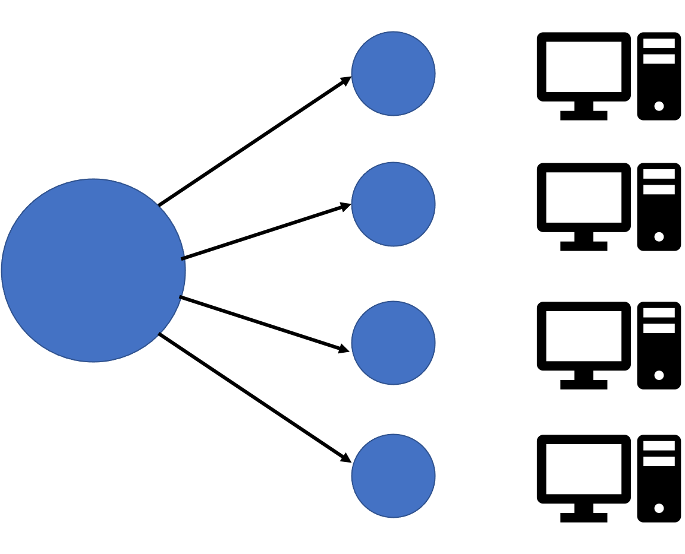
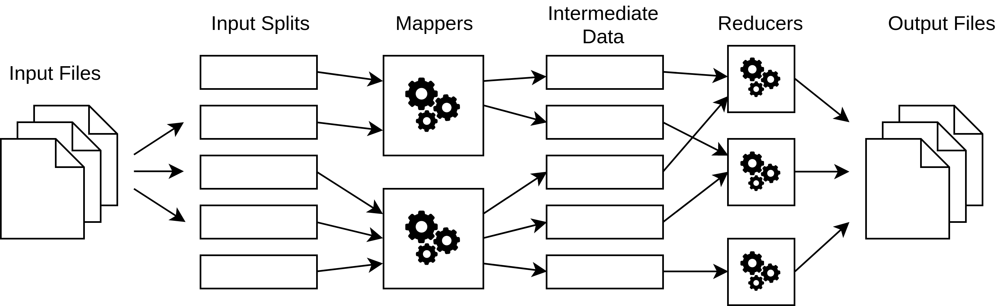

## Introduction: performance issues

Particularly when dealing with "big data", 
the __size of the datasets__ and the __resources at our disposal__ impose __limits__ on what computations we can realistically do.

. . .

Even when a solution for a problem exists in theory, in practice we are bound by __limited resources__:

::: {.compressed-list}
- __Memory size__: can we keep everything we need in memory or do we need to write to the disk often?
- __Processing power__: do we have enough processors to complete the computation in a reasonable time?
- __Network bandwidth__: can we transfer everything we need?
:::

## Learning outcomes

* Identify key issues affecting the performance of data analysis tasks.
* Use 'big O' notation to describe the scaling behaviour of algorithms.
* Assess the benefits and drawbacks of using cloud services to scale computations. 
* Explain how we can break down and distribute large computational tasks.

## Problem scaling

Just because we can solve a problem on a small dataset doesn't guarantee that we can do it for large ones!

. . .

We must also consider the __scaling behaviour__: a dataset that is 10x larger may require much more than 10x longer to process.

. . .

How an algorithm scales with the input size $N$ can be expressed in asymptotic 'big-O' notation. For example:

:::{.compressed-list}
- $O(\log N)$: logarithmic in the size of the input.
- $O(N)$: linear in the size of the input.
- $O(N^2)$: quadratic in the size of the input.
- $O(2^N)$: exponential in the size of the input.
:::

## Problem scaling

The scaling behaviour of an algorithm can have a significant effect in how it can handle large input data:

. . .

```{python}
#| output: true
import matplotlib.pyplot as plt
import numpy as np

N = np.arange(1, 100)
fig, ax = plt.subplots()
ax.plot(N, N, label=r"$O(N)$")
ax.plot(N, N * np.log(N) / 2, label=r"$O(N \log N)$")
ax.plot(N, N**2 / 10, label=r"$O(N^2)$")
ax.set_xlabel("Size of input $N$", fontsize=12)
ax.set_ylabel("Cost", fontsize=12)
ax.legend()
```

## Improving resources

An obvious approach is to throw more resources at the problem: more memory, faster networks, better processors. However:

- We need to make sure it's the right resource! Hence: __profiling__ to understand resource consumption and bottlenecks.
- More resource is not always available.
- There may be other considerations e.g. energy consumption.

## Cloud computing

A paradigm that is becoming very popular recently is the use of __cloud resources__: storage and computing resources held __remotely__ and __available on demand__.

. . .

We saw an example of this in Lecture 22 when downloading data from S3 (Amazon Web Services).

. . .

Major providers include _Amazon Web Services_, _Microsoft Azure_ and _Google Cloud Platform_. 

## Cloud resources

Cloud providers offer a variety of resources, such as:

- __Storage__ (both files and various databases).
- __Compute__ (virtual machines, clusters for parallel computing).
- __Services__ (instances of popular programs like Tensorflow).

## Cloud computing advantages

This offers several advantages:

- __Flexibility__: resources can be requested as and when needed, and can be scaled up or down depending on requirements.
- __No maintenance__: updates are usually taken care of automatically by the provider.
- __Ease of setup__: can use a service without worrying about setting up the infrastructure for it.

## Cloud computing disadvantages

However, there are also considerations to keep in mind:

- __Cost__: can be difficult to predict.
- __Limited customisability__ compared to setting it up yourself.
- __Geographical constraints__ for data storage and processing (e.g. latency, personal data).

## Alternative approaches

Instead of using more or bigger resources, we could look at different kinds of technologies and computational approaches:

- Different language(s), libraries, algorithms.
- Accelerator devices such as graphics processing units.
- Parallel and distributed processing on multiple processors or a cluster.

. . .

These usually involve more work in adapting the solution but, if effective, can yield important benefits.

## Breaking down the task {.nostretch .slides-only}

A small resource (e.g. computer) can handle a small task:

{width="281px" fig-alt="A small task represented by a blue circle, matched to a small computer."}

## Breaking down the task {.nostretch .slides-only}

Faced with a large task, instead of increasing size of resource...

{width="562px" fig-alt="A large task represented by a large blue circle, matched to a large computer."}

## Breaking down the task {.nostretch .slides-only}

...break it down into smaller tasks:

{width="576px" fig-alt="A large task being split into many smaller ones, each matched to a small computer."}

## Breaking down the task {.slides-only}

This is still not trivial:

- Does the algorithm support it?
- Can we efficiently combine results?
- Is there support for doing it on the hardware?

## Changing algorithms

- Reformulate in different steps that allow separation.
- Maximize degree of parallelism.
- Minimize communication.
- Maintain correctness, avoid problems e.g. deadlock.

## MapReduce

How do we efficiently break down tasks and combine results?

{width="60%" fig-alt="Schematic of the Map Reduce approach taken from bcongdon/corral GitHub repository."}

::: {.compressed-list}
- Break down data into smaller chunks.
- Handle each chunk separately.
- Group together results from smaller chunks.
- Combine smaller results to form result from whole input.
:::

## Example: MapReduce in Python

We can construct a very minimal (and non-parallelised) Python implementation of a MapReduce 'engine' as follows

```{python}
#| echo: true
#| code-line-numbers: 3|5|6|1,4,7|8,10,12|8-9,11-12
from collections import defaultdict

def mapreduce(data, mapper, reducer):
    grouper = defaultdict(list)
    for chunk in data:
        for key, value in mapper(chunk).items():
            grouper[key].append(value)
    return {
        k2: v2 
        for k1, v1 in grouper.items() 
        for k2, v2 in reducer(k1, v1).items()
    }
```

## Example: counting characters

As an example task imagine we want to count the number of occurrences of each character in a sentence.

. . .

We can apply `mapreduce` by

::: {.compressed-list}
- using the _mapper_ to assign a partial count of 1 to each character, 
- the _grouper_ then gathers the partial counts for each character,
- and the _reducer_ sums the counts to outputs the counts per character.
:::

## Example: counting characters {.slides-only}

In code:

```{python}
#| echo: true
#| code-line-numbers: 1,5|2|3|4|6
#| output-location: fragment
character_counts = mapreduce(
    data="The quick brown fox jumps over the lazy dog.",
    mapper=lambda character: {character: 1},
    reducer=lambda character, partial_counts: {character: sum(partial_counts)}
)
print(character_counts)
```

. . .

Or sorting the output:

```{python}
#| echo: true
#| output-location: fragment
print(dict(sorted(character_counts.items())))
```

## Summary

- The size of big data poses difficulties on conventional processing.
- Using more powerful resources is a possibility, but sometimes a paradigm change is needed.
- Conversion (such as by distributing computation) is not always straightforward but frameworks offer support.
