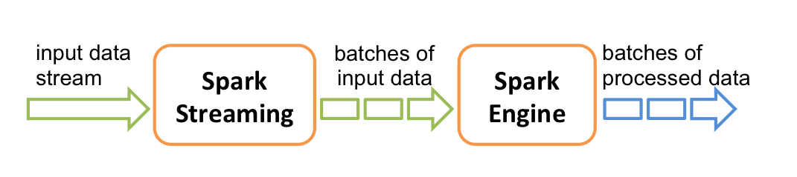
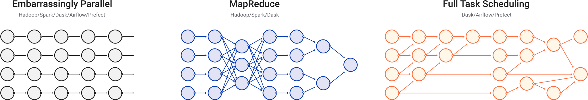

## Introduction

This lecture will talk about three open-source frameworks for __large scale data processing__:

- Apache Hadoop,
- Apache Spark,
- Dask.

. . .

All three allow users to take advantage of __distributed architectures for data processing__.

## Learning outcomes

- Describe the key features of Hadoop, Spark and Dask.
- Recognize the advantages of using distributed file systems for data processing.
- Use `pyspark` to programmatically access Spark's capabilities.
- Explain why we would want to perform stream data processing.
- Compare Spark and Dask's differences and similarities.

## Hadoop

Hadoop is a framework with several components.

. . .

We will focus on two of them:

- The __Hadoop Distributed File System (HDFS)__.
- An implementation of __MapReduce__.

. . .

Together, these two elements let users __distribute data processing__ across many nodes without having to worry (too much) about how files are structured or how computation is performed.

## Distributed file systems

Distributed file systems store files across __many storage nodes__.

. . .

Instead of a single copy, each file resides in __multiple copies__ across __different parts__ of the system. 

::: {.compressed-list}
- __Data locality__ - processing tasks can locally access data they need.
- __Consistency__ ensured through synchronization.
- __Scalable__ by adding more nodes.
- __Resistant__ to failure.
- __Transparency__ - the user should not need to know the details of how the file system works.
:::

## Hadoop MapReduce

To write a MapReduce application in Hadoop, a user must:

::: {.compressed-list}
- Specify the _mapper_ (how should a small chunk of data be processed?).
- Specify the _reducer_ (how should the mapper results be combined?).
- Get the data onto HDFS (the cluster nodes).
- Launch the job by pointing to the data, mapper and reducer.
:::

. . .

Hadoop is Java based but it is possible to specify the mapper and reducer in other languages using the [Hadoop Streaming](https://hadoop.apache.org/docs/r1.2.1/streaming.html) interface - for example [in Python](https://www.michael-noll.com/tutorials/writing-an-hadoop-mapreduce-program-in-python/).


## Hadoop MapReduce {.slides-only}

Once these components are specified and a job is launched, Hadoop takes care of the rest, including the communication between the different stages and determining on which nodes processing occurs.

. . .

This can be powerful for __handling large volumes__ of data relatively __simply__.

. . .

While powerful, Hadoop MapReduce is mainly appropriate for large __batch processing__ tasks.

## Hadoop MapReduce data flow

The MapReduce model enforces a linear data flow structure:

::: {.compressed-list}
- data chunks are read from disk in the HDFS,
- the mapper processes the data chunks,
- the reducer combines the mapper outputs,
- the results are written back to disk in the HDFS.
:::

. . .

This restriction makes Hadoop MapReduce __less efficient__ for __iterative algorithms__ and
__interactive data exploration__, due to the __high overhead__ of repeatedly reading and writing
to disk.

## Spark

Apache Spark is a framework for processing large amounts of data __in memory__.

. . .

It supports more general workflows than Hadoop MapReduce, 
and by __avoiding writing to disk__ unless needed, 
allows more efficient __iteration__ and __data exploration__.

. . .

It can run __on top of Hadoop__ and take advantage of HDFS.

## Spark features

Basic features of Spark:

- __Lazy__: does not perform computations until required.
- __In-memory processing__: faster than using disk storage.
- __Resilience__: steps used to produce data tracked to allow reconstruction.
- __Streams__: can handle data in real time as it arrives ("online").

## Spark SQL and datasets

Spark comes with interfaces in a few languages, including Python ([`pyspark`](https://spark.apache.org/docs/latest/api/python/getting_started/index.html)).

. . .

These offer __programmatic access__ to its various capabilities.

. . .

__Spark SQL__ is a component for __structured data processing__ 
with support for __executing SQL queries__.

. . .

The key abstractions in Spark SQL are `Dataset`s and `DataFrame`s - `pyspark` only supports `DataFrame`s.

. . .

These both represent collections of items that may be __distributed over multiple nodes__.

## Example: `pyspark` pandas

`DataFrame`s can be created by specifying the values directly, or by reading from and transforming an existing source (including a Pandas `DataFrame`).

```{python}
#| output: false
import warnings
# Ignore FutureWarning as installed Pyspark version uses deprecated method
warnings.simplefilter(action='ignore')
```

```{python}
#| echo: true
#| output-location: fragment
import pyspark.pandas as ps

dataframe = ps.DataFrame({"x": [1, 2.1, 3.5],  "y": [2, 4.2, 7]})
dataframe
```


## Example: `pyspark` pandas {.slides-only}

Spark `DataFrame`s can also be handled like pandas `DataFrame`s:

```{python}
#| echo: true
#| output-location: fragment
dataframe["z"] = dataframe["x"] * dataframe["y"]
dataframe
```

. . .

This allows using Spark's distributed processing functionality without major changes from code that originally used pandas.

. . .

The distributed nature of the data is __transparent__.

## MLlib

Spark includes an extensive _Machine Learning library_ ([`MLlib`](https://spark.apache.org/docs/latest/ml-guide.html)), with support for

::: {.compressed-list}
- classification,
- regression,
- clustering,
- reading from different file types,
- data pipelines.
:::

. . .

Using Spark's `MLlib` allows taking advantage of distributed processing more easily than for example `scikit-learn`.

## Example: `MLlib` logistic regression 

To allow us to demonstrate fitting a logistic regression model with `MLlib`,
we first download an example data file and save it in a local temporary file:

```{python}
#| echo: true
#| output: false
#| code-line-numbers: 1,4-7|2,8|9-11
import urllib.request
import tempfile

response = urllib.request.urlopen(
    "https://raw.githubusercontent.com/apache/spark/"
    "master/data/mllib/sample_libsvm_data.txt"
)
data_temp_file = tempfile.NamedTemporaryFile()
with open(data_temp_file.name, "wb") as f:
    contents = response.read()
    f.write(contents)
```

## Example: `MLlib` logistic regression {.slides-only}

We now train a logistic regression model and print the fitted parameters ([adapted from the Spark documentation](https://github.com/apache/spark)):

```{python}
#| echo: true
#| output-location: fragment
#| code-line-numbers: 1,4|5|2,6|7|8-9
from pyspark.sql import SparkSession
from pyspark.ml.classification import LogisticRegression

spark = SparkSession.builder.getOrCreate()
data = spark.read.format("libsvm").load(data_temp_file.name , numFeatures=692)
model = LogisticRegression(maxIter=10, regParam=0.3, elasticNetParam=0.8)
model = model.fit(data)
print(f"Coefficients = {repr(model.coefficients)}\n")
print(f"Intercept = {model.intercept}")
```

## Spark Streaming

In many cases, it is not possible to access all the data at once, due to size or availability.

. . .

[Spark Streaming](https://spark.apache.org/docs/latest/streaming-programming-guide.html) allows processing data points __as they arrive__. 

. . .




It does this by creating small __batches__ of data, calculating __processed results__, and updating those as more data arrives.

## Spark Streaming {.slides-only}

- Can incorporate __real-time data__.
- Can be more efficient when loading __large datasets__ or from sources with __high latency__.
- Algorithm and program structure may need to be __adapted__, but Spark provides features for "hiding" that.
- MLlib contains implementations for fitting on streaming training data, or making predictions on streaming test data.

## Dask

[Dask](https://docs.dask.org/en/stable/) is _a Python library for parallel and distributing computing_.

. . .

Dask [shares similarities with Apache Spark](https://docs.dask.org/en/stable/spark.html) in using a _lazy evaluation_ model, providing a [pandas-like `DataFrame` interface](https://docs.dask.org/en/stable/dataframe.html) and supporting [streaming computation](https://docs.dask.org/en/stable/spark.html#streaming).

. . .

Unlike Spark, Dask is written in and __primarily used within Python__,
and is __tightly integrated__ with other packages in the wider Python ecosystem.

. . .

Dask does not support SQL but equivalent operation can be performed using its Python interface.

## Dask task scheduling

Dask supports a generic __task-scheduling__ paradigm that can make it more flexible than alternatives such as Spark

. . .



. . .

A __graph__ of the tasks corresponding to a computation is built and can be then be executed on a variety of __schedulers__
working on both single-machines and clusters.

## Example: Dask timeseries analysis

As a simple example, we construct a simulated timeseries `DataFrame` in Dask using the [`dask.dataset.timeseries` function](https://docs.dask.org/en/stable/api.html#dask.datasets.timeseries)

```{python}
#| echo: true
import dask

dataframe = dask.datasets.timeseries(
  start="2000-01-01", end="2000-01-29", seed=1234, partition_freq="7d"
)
```

. . .

The generated `DataFrame` here is relatively large:

```{python}
#| echo: true
#| output-location: fragment
print("Number of records: ", dataframe.size.compute())
```

## Example: Dask timeseries analysis {.slides-only}

Importantly Dask data structures are _partitioned_ to allow distributing computations
on chunks of the data.

```{python}
#| echo: true
#| output-location: fragment
dataframe
```

## Example: Dask timeseries analysis {.slides-only}

As with pandas `DataFrame` objects we can use the `head` method to inspect the first few rows

```{python}
#| echo: true
#| output-location: fragment
dataframe.head()
```

## Example: Dask timeseries analysis {.slides-only}

Dask `DataFrame`s provide a pandas like interface which we can use to perform filtering, grouping and aggregation operations.

```{python}
#| echo: true
#| output-location: fragment
filtered = dataframe[dataframe.x > 0]
grouped = filtered.groupby("name")
results = grouped["x", "y"].std()
results
```

## Example: Dask timeseries analysis {.slides-only}

Unlike pandas where operations are evaluated _eagerly_, operations in Dask are evaluated _lazily_
with an expression graph being built representing the applied operations.

## Example: Dask timeseries analysis {.slides-only}

We can visualize the _expression graph_ associated with a Dask `DataFrame` using the `visualize` method

```{python}
#| echo: true
#| output-height: 3
#| output-width: 3
results.visualize(rankdir="TD")
```

## Example: Dask timeseries analysis {.slides-only}

We can also _optimize_ the expression graph, for example fusing operations

```{python}
#| echo: true
optimized = results.optimize()
optimized.visualize(rankdir="TD")
```

## Example: Dask timeseries analysis {.slides-only}

We can also instead visualize the constructed _task graph_

```{python}
#| echo: true
optimized.visualize(tasks=True, rankdir="LR")
```

## Example: Dask timeseries analysis {.slides-only}

Calling the `compute` method on a Dask `DataFrame` will _schedule_ the attached task graph,
and output a pandas `DataFrame`

```{python}
#| echo: true
#| output-location: fragment
optimized.compute().head()
```

. . .

Dask defaults to  a __threaded scheduler__ to run computations,
but __distributed schedulers__ can be used instead.

## Summary

- Using frameworks makes it much easier to build applications with distributed data processing.
- Hadoop and Spark are complementary: Hadoop provides more basic functionality, while Spark can run standalone and is better for data that fits in memory.
- Dask is a modern Python based alternative to Spark for distributed data processing that offers a very general task scheduling framework.
