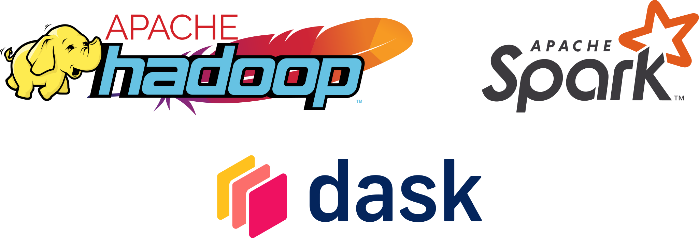

## Data pipelines

_Data pipelines_ are an abstraction for thinking about data analysis workflows.

. . .

```{mermaid}
flowchart LR
    access --> preprocess --> transform --> serve --> model:::highlight -->  publish
    classDef default fill:#00c0c3,stroke-width:0;
    classDef highlight fill:#f9c437;
```

Can be visualised as a _directed acyclic graph_ (DAG) showing how data 'flows' between different stages of analysis.

. . .

Defining all stages of a data pipeline programmatically allows us to _reproduce_ the analysis.

. . .

Published data artefacts should aim to be FAIR - _findable_, _accessible_, _interoperable_ and _reusable_.

## Data pipelines {.slides-only}

- How can we visualize data pipelines?
- What are the advantages of defining a data pipeline programmatically?
- What issues should we consider when publishing the outputs of a data workflow?

## Data version control


_Data version control_ is a way of systematically keeping track of models and datasets.

. . .

```{mermaid}
gitGraph
    commit id: "a13fb"
    commit id: "cb28d"
    commit id: "2ef7c"
    branch develop
    commit id: "ff86a"
    checkout main
    commit id: "46cd3"
    merge develop
    commit id: "54eb9"
```

Builds on _Git_, a general version control system, which allows us to track changes in a directory of files.

. . .

DVC extends Git by 

:::compressed-list
- giving better support for working with large data files,
- integration with remote data providers,
- abstractions for thinking in terms of data workflows.
:::

## Data version control {.slides-only}

- Why should we use version control?
- How does data version control (DVC) differ from version control systems such as Git?
- How does DVC represent data pipelines?

## Databases

_Databases_ are collections of data organized in a way that allows more efficient storage and retrieval.

. . .

```{mermaid}
erDiagram
     direction LR
     Person{
        text id
        text personal
        text family
     }
     Visited{
        integer id
        text site
        text dated
     }
     Site{
        text name
        real lat
        real long
     }
     Person ||--|| Visited : " "
     Visited ||--|| Site : " "
```

_Relational databases_ store data in tables with columns with fixed names and types and relational constraints between primary and foreign keys across tables.

. . .

_Structured Query Language_ (SQL) provides a standardized approach to extracting, aggregating and updating data in relational databases.

. . .

Non-relational databases offer an alternative approaches for working with less rigidly structured data.

## Databases {.slides-only}

- What are the benefits of using a database to store and access data?
- How can we specify the structure of a relational database?
- How do we select data subsets of interest from a relational database? 
- What are the advantages and disadvantages of non-relational ('NoSQL') databases compared to relational databases?

## Working with lots of data


When working with 'big data' the size of datasets and resources available limit the computations we can perform.

. . .

One option is to increase our available resources for a problem - for example by exploiting cloud compute services.

. . .

An alternative approach is to break down the problem in to smaller subtasks that can be distributed.

. . .

MapReduce offers one particular framework for efficiently breaking down tasks and combining results

{alt="MapReduce schematic" fig-align="center"}


## Working with lots of data {.slides-only}

- What are key issues affecting the performance of data analysis tasks?
- How can we describe the scaling behaviour of the algorithms we use?
- What are the benefits and drawbacks of using cloud services as an approach for scaling computations?
- How can we break down and distribute large computational tasks?

## Software frameworks

{alt="Logos of Hadoop, Spark and Dash" fig-align="center"}

Apache Hadoop, Apache Spark and Dash are three open-source frameworks for large scale data processing.

. . .

Hadoop provides a distributed file system and implementation of MapReduce framework.

. . .

Spark allows processing large amounts of data _in-memory_ and supports more general workflows than
Hadoop's MapReduce.

. . .

Dask is modern native Python framework for distributed data processing that supports a generic _task-scheduling_ paradigm.

## Software frameworks {.slides-only}

- What are the key features of Hadoop, Spark and Dask and how do they differ?
- Why would we use a distributed file system for data processing?
- What is streaming data?
- How does Dask abstract computations to allow them to be optimized and distributed?

## General exam tips

- You need to know how to _apply_ concepts and tools covered in lectures to real data problems.
- Make sure to justify and explain points you are making - need to see evidence of _understanding material_ not just recall.
- __Read the exam rubric carefully__ - each question should be answered in a separate booklet.